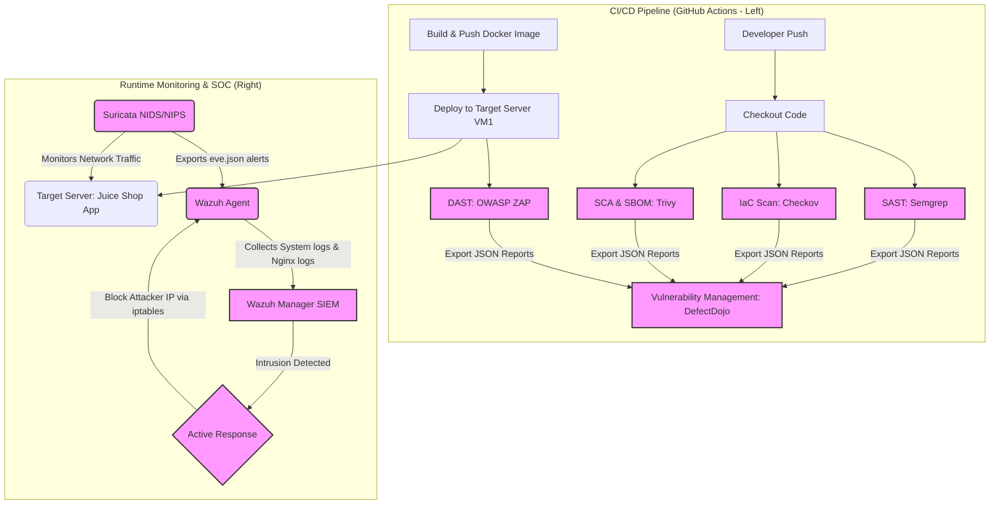

# Complete DevSecOps Pipeline & Security Operation Center (SOC) Integration

This project demonstrates a comprehensive, production-ready **DevSecOps Pipeline** combined with a **Security Operation Center (SOC)** monitoring system. It implements a secure software development lifecycle (SSDLC) by shifting security both **Left** (CI/CD static & dynamic scanning) and **Right** (Runtime intrusion detection and centralized SIEM monitoring).

---

## ─── 🏗️ System Architecture ───



---

## ─── 🚀 Key Security Components ───

### 1. DevSecOps (Shift-Left Security)
* **Static Application Security Testing (SAST):** Utilizes **Semgrep** to scan custom source code for common security bugs, code smells, and owasp top 10 vulnerabilities.
* **Infrastructure as Code (IaC) Scanning:** Utilizes **Checkov** to analyze Dockerfiles, Docker Compose configurations, and system configurations for misconfigurations.
* **Software Composition Analysis (SCA) & SBOM:** Utilizes **Trivy** to generate Software Bill of Materials (SBOM) and scan open-source dependencies for known vulnerabilities (CVEs).
* **Dynamic Application Security Testing (DAST):** Utilizes **OWASP ZAP** to scan the running web application (OWASP Juice Shop) for runtime vulnerabilities like XSS, SQLi, and broken authentication.
* **Centralized Vulnerability Management:** Automatically parses and uploads all scan results from the tools above into **DefectDojo** using a custom integration script.

### 2. Security Operations Center (Shift-Right & Runtime Protection)
* **Network Intrusion Detection System (NIDS):** Uses **Suricata** running on the Target Server to monitor network packets on interface `ens33`. It detects network scans, brute-force attempts, and web attacks.
* **Host Intrusion Detection System (HIDS) & SIEM:** Configures **Wazuh Agent** on the Target Server to monitor host logs, Nginx access logs, file integrity (FIM), and Suricata's `eve.json` alerts, sending them to **Wazuh Manager**.
* **Active Response (Automated Defense):** When Wazuh detects a high-severity alert (such as XSS or SQLi), it triggers an automated response script on the Target Server to drop the attacker's IP using `iptables` for 10 minutes.

---

## ─── 📁 Project Structure ───

```text
DevSecOps/
├── .github/workflows/
│   └── devseceops.yml          # GitHub Actions CI/CD Pipeline
├── docker-compose.yml          # Application deployment configurations
├── juice-shop/                 # Target application source code
├── scripts/                    # Automation scripts
│   ├── run-semgrep.ps1         # Run Semgrep scan
│   ├── run-checkov.ps1         # Run Checkov scan
│   ├── run-trivy.ps1           # Run Trivy SCA & SBOM generator
│   ├── run-zap.ps1             # Run OWASP ZAP DAST scan
│   ├── import-defectdojo.ps1   # Import findings to DefectDojo API
│   ├── deploy.ps1              # Deployment script to Target Server
│   ├── deploy-suricata.ps1     # Automated Suricata installer & configurer
│   └── health-check.ps1        # Application deployment health check
└── README.md                   # Project documentation
```

---

## ─── 🛡️ Runtime Attack Simulation & Verification ───

To demonstrate the effectiveness of the NIDS + SIEM defense architecture, we can simulate attacks from an external host and observe the system's response:

### Test Case 1: Cross-Site Scripting (XSS) Detection & Blocking
* **Attack Payload (via Browser or Curl):**
  ```bash
  curl "http://<TARGET_IP>:3000/?search=<script>alert(1)</script>"
  ```
* **Detection Mechanism:**
  1. **Suricata** intercepts the raw packet on the wire, decodes the HTTP URI, matches the payload against rule `1000003` (`CUSTOM XSS Attempt Detected`), and logs it to `/var/log/suricata/eve.json`.
  2. **Wazuh Agent** forwards the alert to **Wazuh Manager**, matching Rule ID `86601` (Suricata Alert).
* **Automated Action:** **Wazuh Active Response** triggers `firewall-drop` script on the Target Server, blocking the attacker's IP via `iptables` for 10 minutes.

### Test Case 2: SQL Injection (SQLi) Detection
* **Attack Payload:**
  ```bash
  curl "http://<TARGET_IP>:3000/?id=1%27%20UNION%20SELECT%20NULL,username,password%20FROM%20users--#/"
  ```
* **Detection:** Suricata parses the normalized URI and matches rule `1000004` (`CUSTOM SQLi Attempt Detected`), logging the activity for SOC Analysts to review on the Wazuh Dashboard.

---

## ─── 🌟 Resume Bullet Points for Candidates ───
*(Great for highlighting on your CV/LinkedIn)*
* **DevSecOps Integration:** Engineered a fully automated GitHub Actions pipeline integrating SAST (Semgrep), IaC (Checkov), SCA (Trivy), and DAST (OWASP ZAP), automating vulnerability tracking by exporting all reports directly to DefectDojo.
* **SIEM & SOC Operations:** Architected a runtime threat detection mechanism utilizing Suricata (NIDS) and Wazuh (SIEM), monitoring real-time network traffic and system state changes across servers.
* **Automated Incident Response:** Implemented Wazuh Active Response to dynamically mitigate attacks (XSS, SQLi) in real-time by automatically blacklisting malicious IPs using Linux `iptables` rules.
* **Performance Optimization:** Resolved virtualization conflicts (Checksum Offloading issues) by tweaking TCP stack configurations and network drivers (`ethtool`) to ensure 100% network intrusion detection visibility.
